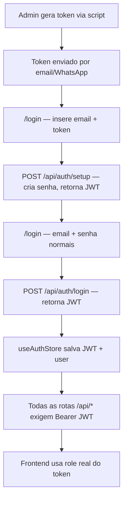

# Auth Real — Agzos Command Center

## Contexto atual
- `useAuthStore` usa `MOCK_USERS` e `switchRole` — sem auth real
- `RoleSwitcher` é um simulador de perfil (permanece, mas só visível para admins)
- API não tem nenhuma rota `/auth/*` nem middleware de autenticação
- Banco não tem tabela `users` (pasta `db/` não existe ainda no api-server)
- `app.ts` já tem `cors` com header `Authorization` permitido
- Stack: Express 5, Drizzle ORM, PostgreSQL, React + Zustand + Wouter

## Arquitetura



## O que será criado

### Backend — `artifacts/api-server/src/`

**1. Tabela `users` no banco**
- Arquivo: `src/db/schema.ts` (novo)
- Campos: `id`, `email`, `passwordHash`, `name`, `role` (enum dos 7 roles), `inviteToken`, `inviteUsedAt`, `createdAt`
- Drizzle migration via `drizzle-kit push`

**2. Dependências a instalar**
- `bcryptjs` + `@types/bcryptjs` — hash de senha
- `jsonwebtoken` + `@types/jsonwebtoken` — JWT
- `drizzle-kit` — migrations (já pode estar no workspace)

**3. Rotas de auth — `src/routes/auth.ts`**
- `POST /api/auth/setup` — recebe `{ email, token, password, name }`, valida token, cria hash, salva, retorna JWT
- `POST /api/auth/login` — recebe `{ email, password }`, valida, retorna JWT com payload `{ id, email, name, role }`
- `GET /api/auth/me` — retorna user autenticado (requer JWT)

**4. Middleware `requireAuth` — `src/middleware/auth.ts`**
- Valida `Authorization: Bearer <jwt>`
- Injeta `req.user` com `{ id, email, name, role }`
- Aplicado em todas as rotas existentes via `app.use("/api", requireAuth, router)` — exceto `/api/auth/*`

**5. Script de seed — `src/scripts/seed-admins.ts`**
- Gera 2 tokens aleatórios (crypto.randomUUID)
- Insere os 2 usuários admin no banco com `inviteToken` e sem senha
- Imprime os tokens no console para envio manual
- Executado uma única vez: `pnpm tsx src/scripts/seed-admins.ts`

**6. Variáveis de ambiente a adicionar no `.env`**
```
JWT_SECRET=<string longa aleatória>
JWT_EXPIRES_IN=7d
```

### Frontend — `artifacts/agzos-hub/src/`

**7. Página de login — `src/pages/login.tsx`**
- Dois modos via tab: "Entrar" (email + senha) e "Primeiro acesso" (email + token + nome + senha)
- Chama `POST /api/auth/setup` ou `POST /api/auth/login`
- Salva JWT no `useAuthStore`

**8. Refatorar `useAuthStore` — `src/store/useAuthStore.ts`**
- Remover `MOCK_USERS` e `switchRole` (ou manter `switchRole` só para admins como simulador)
- Adicionar: `token: string | null`, `login(jwt, user)`, `logout()`
- `user` vem do JWT decodificado / resposta da API
- Persistir `token` no localStorage (já usa `persist`)

**9. Proteção de rotas — `src/App.tsx`**
- Adicionar rota `/login` fora do `AppLayout`
- Wrapper `<ProtectedRoute>` que redireciona para `/login` se não autenticado
- Todas as rotas existentes ficam dentro do `ProtectedRoute`

**10. `RoleSwitcher` — `src/components/RoleSwitcher.tsx`**
- Manter o componente, mas só renderizar se `user.role === "admin"`
- `switchRole` passa a ser apenas visual/simulação local (não altera o JWT)

**11. Botão de logout no sidebar — `src/components/layout.tsx`**
- Adicionar botão "Sair" no rodapé do sidebar que chama `logout()` e redireciona para `/login`

## Arquivos afetados

- `artifacts/api-server/src/db/schema.ts` — novo
- `artifacts/api-server/src/routes/auth.ts` — novo
- `artifacts/api-server/src/middleware/auth.ts` — novo
- `artifacts/api-server/src/scripts/seed-admins.ts` — novo
- `artifacts/api-server/src/routes/index.ts` — adicionar authRouter
- `artifacts/api-server/src/app.ts` — aplicar requireAuth
- `artifacts/agzos-hub/src/store/useAuthStore.ts` — refatorar
- `artifacts/agzos-hub/src/pages/login.tsx` — novo
- `artifacts/agzos-hub/src/App.tsx` — adicionar rota /login + ProtectedRoute
- `artifacts/agzos-hub/src/components/layout.tsx` — botão logout
- `artifacts/agzos-hub/src/components/RoleSwitcher.tsx` — restringir a admin
- `.env` e `.env.example` — adicionar JWT_SECRET e JWT_EXPIRES_IN

## Fluxo de primeiro uso

1. Rodar `pnpm tsx src/scripts/seed-admins.ts` → gera 2 tokens
2. Enviar token para `rodrigo.azevedo1988@gmail.com` e `darnaldo00@gmail.com`
3. Cada um acessa `/login`, aba "Primeiro acesso", insere email + token + nome + senha
4. A partir daí, login normal com email + senha
5. Somente admins podem atribuir roles a outros usuários (via tela de Equipe existente)
