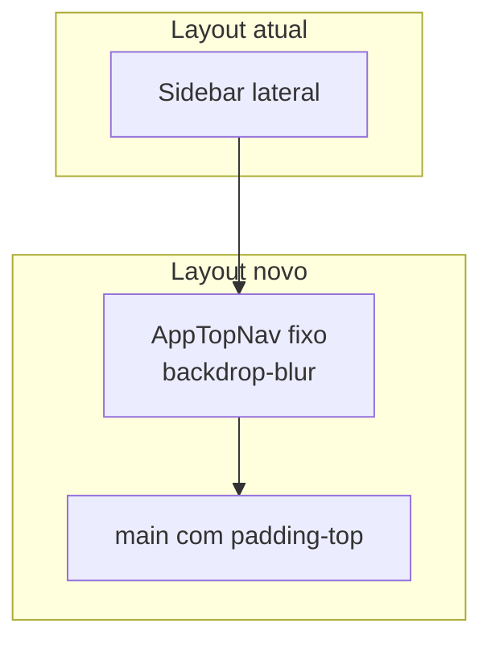

# Rebrand + Header horizontal — Agzos Command Center

## Situação atual

O frontend em [`artifacts/agzos-hub`](artifacts/agzos-hub) combina:

- Identidade provisória (roxo, Inter, **Agzos Hub**)
- Layout **sidebar lateral** (`aside` 256px) + **topbar** separada ([`layout.tsx`](artifacts/agzos-hub/src/components/layout.tsx))

| Aspecto | Atual | Alvo |
|---------|--------|------|
| Nome | Agzos Hub | **Agzos Command Center** |
| Primária | `#A855F7` | `#D10A11` |
| Fundo / texto | `#0A0A0A` / `#F8FAFC` | `#0E0E0E` / `#FFFDFD` |
| Fonte | Inter | **Figtree** |
| Navegação | Sidebar vertical + topbar | **Header horizontal fixo** (padrão 21st `header-03`) |
| Logo | Texto gradiente roxo | SVG [`Agzos Strategy`](Agzos%20Strategy/Logos) |



## Pré-requisitos do projeto (já atendidos)

- **shadcn**: [`components.json`](artifacts/agzos-hub/components.json) → componentes em `@/components/ui`
- **Tailwind 4** + **TypeScript**: [`src/index.css`](artifacts/agzos-hub/src/index.css), `tsconfig.json`
- **UI já instalada**: `navigation-menu`, `sheet`, `button`, `accordion`, `toggle`, `badge` — **não** sobrescrever com o paste do snippet; manter versões do projeto (new-york + lucide)
- **Tema**: [`useThemeStore`](artifacts/agzos-hub/src/store/useThemeStore.ts) (Zustand) — **não** usar `next-themes` nem `ThemeProvider` (pacote existe mas não é o padrão do app)
- **Ícones**: **lucide-react** (`Menu`, `X`, `Sun`, `Moon`, `ArrowUpRight`, ícones de `NAV_ITEMS`) — **não** instalar `@aliimam/icons`

## Escopo

**Incluído:** rebrand + novo shell de layout em `artifacts/agzos-hub`, login, copy/PDF, README, OpenAPI description.

**Fora de escopo:** renomear pacote `@workspace/agzos-hub`, `mockup-sandbox`, `api-server`.

---

## Parte A — Identidade visual (rebrand)

### A1. Assets em `public/brand/`

| Destino | Origem |
|---------|--------|
| `logo-dark.svg` | `Agzos Strategy/Logos/SVG/1.svg` |
| `logo-light.svg` | `Agzos Strategy/Logos/SVG/2.svg` |
| `logo-mark.svg` | `Agzos Strategy/Logos/SVG/7.svg` |

Fontes: `public/fonts/figtree/Figtree-VariableFont_wght.ttf`. Favicon = `logo-mark.svg`.

### A2. Tokens — [`src/index.css`](artifacts/agzos-hub/src/index.css)

- `--primary: 358 91% 43%` (`#D10A11`), `--background: 0 0% 5%` (`#0E0E0E`), `--foreground: 0 20% 99%` (`#FFFDFD`)
- `--app-font-sans: 'Figtree', sans-serif`
- Modo `.light` coerente; remover import Inter
- **Keyframes accordion** (ausentes hoje — necessários para mobile Sheet):

```css
@theme inline {
  --animate-accordion-down: accordion-down 0.2s ease-out;
  --animate-accordion-up: accordion-up 0.2s ease-out;
}
@keyframes accordion-down { from { height: 0; } to { height: var(--radix-accordion-content-height); } }
@keyframes accordion-up { from { height: var(--radix-accordion-content-height); } to { height: 0; } }
```

### A3. [`src/lib/brand.ts`](artifacts/agzos-hub/src/lib/brand.ts) + `BrandLogo`

- `APP_NAME`, `APP_SUBTITLE` ("Command Center"), `AGENCY_NAME`, `BRAND` hex
- `BrandLogo`: mark + subtítulo; troca `logo-light` / `logo-dark` via `useThemeStore`

### A4. Copy e defaults

- `index.html` title, [`reports.tsx`](artifacts/agzos-hub/src/pages/reports.tsx), [`notifications.tsx`](artifacts/agzos-hub/src/pages/notifications.tsx), [`useSettingsStore.ts`](artifacts/agzos-hub/src/store/useSettingsStore.ts) (`primaryColor: "#D10A11"`), README, openapi description
- Badges/charts: alinhar roxo decorativo à marca

---

## Parte B — Header horizontal (21st / header-03)

### B1. Princípio de adaptação

O [`header-03`](https://21st.dev) de referência usa mega-menus (Services, Industries…). O Command Center tem **módulos internos com permissões** (`NAV_ITEMS` + `canAccessModule`). Em vez de colar o demo com rotas fictícias:

- Criar **`src/components/AppTopNav.tsx`** (lógica de app — **não** em `ui/`)
- Reutilizar primitivos de `@/components/ui/*`
- Estética 21st: `fixed top-0`, `bg-background/50 backdrop-blur-md`, bloco de logo com `border` + `bg-primary`, nav central, ações à direita
- **Escala compacta** (pedido do usuário): altura total ~`h-14`–`h-16` (não `h-20`/`h-14` por item do demo)

| Elemento demo | Adaptação Command Center |
|---------------|---------------------------|
| Logo Ali Imam `h-14` | `BrandLogo` compact: mark `h-8` + "Command Center" `text-sm` |
| Triggers `h-14 px-6 text-lg` | Grupos `h-9 px-3 text-sm` |
| CTA `h-14` | Botões `size="sm"` (`h-9`) |
| `next-themes` | `useThemeStore` |
| `@aliimam/icons` | `lucide-react` |

### B2. Estrutura do header

```
┌─────────────────────────────────────────────────────────────────────────┐
│ [Logo mark + Command Center]  [Nav grupos / links]     [⌘K][🌙][🔔][👤] │
└─────────────────────────────────────────────────────────────────────────┘
```

**Esquerda** — bloco marca (inspirado no demo):

```tsx
<div className="flex border border-primary/30 bg-primary rounded-md h-11 px-3 items-center gap-2">
  
  <span className="hidden sm:block text-sm font-semibold text-primary-foreground">Command Center</span>
</motion>
```

**Centro (desktop `lg+`)** — `NavigationMenu` com **4 grupos** (reduz clutter vs 11 links soltos):

| Grupo | Módulos |
|-------|---------|
| Painel | Dashboard |
| Operações | Sites, Projetos, Clientes, Calendário |
| Gestão | Equipe, Financeiro, Ferramentas, Relatórios |
| Sistema | Atividade, Configurações |

- Cada item: `Link` wouter + `NavigationMenuLink`; filtrar por `canAccessModule`
- Trigger ativo: `bg-foreground text-background` (demo) ou `bg-primary text-primary-foreground` (marca)
- Dropdown: `rounded-lg p-2`, itens `text-sm`, hover `hover:bg-primary hover:text-primary-foreground`
- Se grupo ficar vazio (permissões), não renderizar o `NavigationMenuItem`

**Direita** — consolidar controles hoje na topbar:

- Busca (dispara ⌘K) — `Button variant="ghost" size="sm"`
- `ModeToggle` — `Toggle size="sm"` com Sun/Moon (padrão header-03, via `useThemeStore`)
- `NotificationBell`
- `RoleSwitcher` (admins)
- Menu usuário: avatar + iniciais, badge de papel, **Sair** (`DropdownMenu` ou botão ghost compacto)

### B3. Mobile (`< lg`)

- `Sheet` lateral direito (como demo)
- `Accordion` com os 4 grupos + links filtrados por permissão
- Link direto **Notificações** (com badge unread) no topo do sheet
- Header mobile: logo compacto + `SheetTrigger` (`Menu` / `X`)

### B4. Componentes auxiliares

| Arquivo | Responsabilidade |
|---------|------------------|
| [`src/components/AppTopNav.tsx`](artifacts/agzos-hub/src/components/AppTopNav.tsx) | Header completo; recebe `user`, `visibleItems`, handlers |
| [`src/components/ModeToggle.tsx`](artifacts/agzos-hub/src/components/ModeToggle.tsx) | Toggle tema compacto (extraído do header-03, sem `next-themes`) |
| [`src/lib/nav-groups.ts`](artifacts/agzos-hub/src/lib/nav-groups.ts) | Definição dos grupos + mapeamento `NavModule` → label/href/icon |

**Não** adicionar `header-03.tsx` cru em `ui/` — evita `"use client"`, rotas `/services/...` e dependências Next.

### B5. Refatorar [`layout.tsx`](artifacts/agzos-hub/src/components/layout.tsx)

**Remover:**

- `SidebarNav`, `aside`, `NotifNavLink` na sidebar, topbar duplicada mobile/desktop

**Novo layout:**

```tsx
<div className={cn("min-h-[100dvh] flex flex-col", theme)}>
  <AppTopNav ... />
  <main className="flex-1 pt-16 px-4 md:px-8 overflow-x-hidden">
    <motion className="mx-auto max-w-7xl">{children}</div>
  </main>
  <CommandPalette />
</div>
```

- `pt-16` compensa header `fixed` (~64px)
- Manter `useEffect` que aplica `.dark` / `.light` no `<html>`
- Notificações: ícone no header (não mais rodapé da sidebar)

### B6. Login

- [`login.tsx`](artifacts/agzos-hub/src/pages/login.tsx): `BrandLogo variant="login"` centralizado; sem sidebar

### B7. Dependências NPM

**Não instalar** (já cobertos ou desnecessários): `next-themes` (já no lockfile, não wirear), `@aliimam/icons`, `@radix-ui/react-icons` extra.

**Nenhum pacote novo obrigatório** — Radix/shadcn/lucide já presentes.

### B8. Tokens CSS opcionais para o shell 21st

Em `:root` / utilitários, garantir contraste do padrão “foreground invertido” nos triggers:

- Dark: triggers nav `bg-foreground/10` inativo → ativo `bg-foreground text-background`
- Light: equivalente com `bg-foreground text-background` nos ativos

Ajustar fino após aplicar paleta vermelha.

---

## Parte C — Verificação manual

1. Desktop dark/light: header fixo, blur, logo mark vermelho, nav agrupada legível
2. Mobile: sheet abre, accordion anima, links respeitam `canAccessModule`
3. Tema persiste (`agzos-theme`); toggle compacto sem flash
4. ⌘K, notificações, RoleSwitcher, logout funcionam no header
5. Login com marca; PDF/notificações com "Agzos Command Center"
6. Nenhuma regressão de rota wouter

## Riscos e notas

- **11 módulos**: agrupamento em 4 dropdowns evita overflow; se ainda apertar em `lg`, permitir `overflow-x-auto` na `NavigationMenuList` como fallback
- **Persistência settings**: `primaryColor` antigo `#A855F7` no localStorage — opcional bump `agzos-settings-v2`
- **Test IDs**: preservar `data-testid={`nav-${label}`}` nos links para QA
- **Licenças** fontes em `public/fonts/`

## Ordem de implementação sugerida

1. Assets + tokens + accordion CSS  
2. `brand.ts` + `BrandLogo` + login  
3. `nav-groups.ts` + `ModeToggle` + `AppTopNav`  
4. Refatorar `layout.tsx` (remover sidebar)  
5. Copy/PDF/openapi + polish visual  
